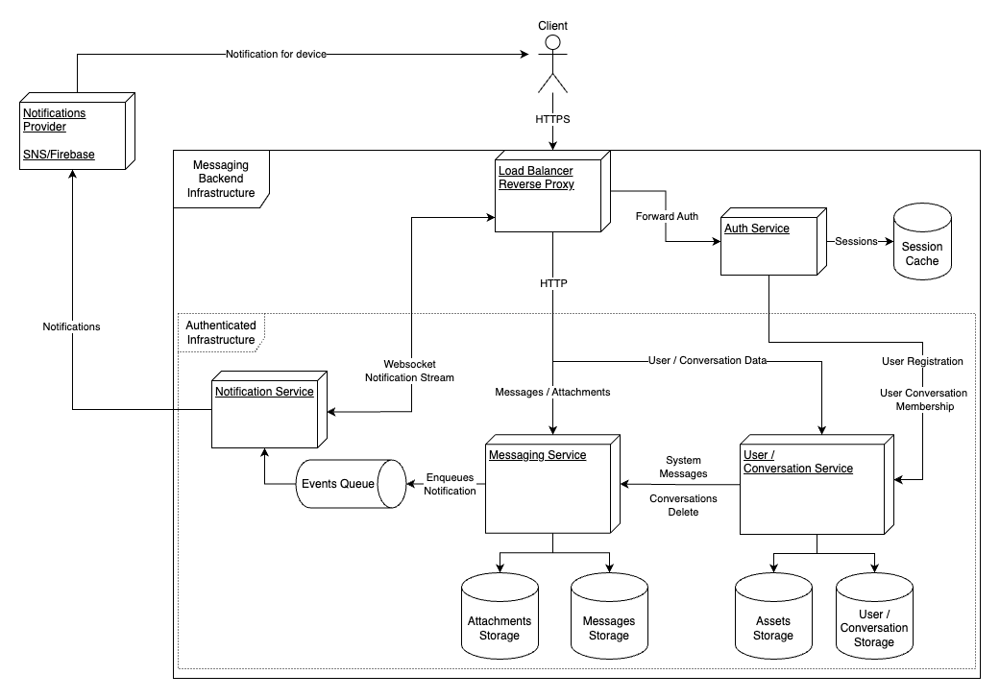

# High level architecture for the messaging backend

The goal here is to describe high level architecture of the backend for messaging application.
In the task, there is a mention of "Whatsapp-, Skype-like" service. However, it is important to understand that those two are two
completely different services with completely different set of requirements and thus technological solutions.

## OTR backends

This is because of the OTR messaging - off the record messaging - or in other words end-to-end encryption for the messages.
When the messenger uses E2EE for the messages - like Whatsapp, it needs to store all messages locally on the client. In such case, the
backend itself does not store all conversation data (all message history), but rather just group memberships, user profiles and
cryptography primitives (public keys). Then it just stores encrypted payloads until receiving client picks them up.

The implication here is that the backend read load is significantly lower than in case when it needs to store the conversation history as
well. Moreover, depending on the used cryptography protocol, it might need to guarantee total ordering of messages and also atomicity of
some transactions - this is for example hard requirement for [MLS](https://en.wikipedia.org/wiki/Messaging_Layer_Security) protocol.
In addition to that, we will have a lot of writes/updates (essentially any query is going to read AND write) - so when scaling database,
read replicas won't solve all of our issues.

Whatsapp, Signal and Wire use [Signal Protocol](https://en.wikipedia.org/wiki/Signal_Protocol) that does not require total ordering, but
one should be able to perform atomic operations over the database when retrieving "prekeys". Prekeys _should be_ used only once, thus
you _should_ guarantee atomic prekey fetch from the backend.

I'm not going to describe this option further, as I already designed, implemented and scaled OTR backend before - architecture, doc,
designs and everything is available in [following repo](https://github.com/LukasForst/wire-for-teams).

## Classic Messaging Backends

When the backend is responsible for the conversation storage, we can expect very high read load on our database -
essentially every time when the client tries to load whole chat, our backend will need to query database and send data. We can assume
that this is going to be the most typical query "give me messages for this conversation". This means that using read database replicas
is a good approach in this case.

Moreover, in this case, we do not _really_ need transactions, because "best effort" ordering is perfectly fine for the chat. With "best
effort" I mean that it is not necessary to sort the messages on millisecond basis, we're fine with 1s. This suggests that we can freely
use NoSQL database, that is going to be easier to scale than the SQL databases.

Choosing right database is tricky, and it usually depends on what load we expect. Even better is to actually verify our expectations
during the first phases of the project. Brilliant article on this topic is from Discord
-> [How Discord Stores Billions of Messages](https://discord.com/blog/how-discord-stores-billions-of-messages) where they describe how
they stared with MongoDB and when they reached certain size, they had to switch to Cassandras.

From the personal experience, I'd avoid Cassandras until our solution reaches load which can not be handled by much simpler MongoDB. At
Wire, we use Cassandra clusters, and it's very problematic to maintain them and keep them consistent.

## Common Problems to Solve

### Scaling

We will definitely need to scale our solution as we go. Either because we want to achieve HA (high availability) OR because we're simply
under very heavy load. To make it as easy as possible for us, we should always try to get rid of any state in the running backend. All
state should be persisted in the database (or queue if necessary). That way, we can easily horizontally scale our backend.

Moreover, we should keep in mind separation of concerns in our application. That way, when we start with a horizontally scalable
monolith, we will easily split it into microservices later - when we actually need that. To achieve that, the modules in our
implementation should be clearly separated, and it must clear what module is doing what.

### Auth

Another thing is the authentication/authorization. It's usually a good idea to separate this problem to a microservice and check
authorization before even letting the request end up in our infrastructure. In almost all cases, we will have either load balancer or
some reverse proxy running on the edge of our infrastructure. We can plug in authentication by utilizing forward
auth ([example](https://doc.traefik.io/traefik/middlewares/http/forwardauth/)).

### Fan-out

A common problem, we will be solving, is fan-out. Messaging application needs notifications, that's for sure. Now
when a user posts a message to conversation with thousands of users, we need to notify all of them, ideally in real time. One can offload
this problem to the cloud by using services such as [Firebase](https://firebase.google.com/) or [SNS](https://aws.amazon.com/sns/). This is
going to be great until our solution has 100M+ users and using these services is going to cost fortune.

Again, at the beginning, I'd choose one of these hosted solutions and once the product reaches high number of users, I'd start thinking
about how can we move out of them. The idea here is not to spend $$$ on developers reinventing the wheel and making them focus on the
more important parts of the product. Once we calculate that developer $$$ are cheaper than the amount we're paying for SNS, we will
implement our own fan-out solution.

### Asset Storage

We need a place / service where we're going to store documents/pictures/videos or whatever other assets the users store. Depending on
our load/number of users, we can again either use hosted object storage such as [S3](https://aws.amazon.com/s3/) or go with some
self-hosted solution as [MinIO](https://min.io/).

## Final Architecture

Considering what I wrote in the previous part, my high level architecture:

### Services

#### Load Balancer / Reverse proxy

Standard entry point for our infrastructure, something like Nginx, Traefik or others. This service is responsible for load balancing of
requests, TLS termination and partially for authentication of requests using forward auth to next Auth Service.

#### Auth Service

Service that authenticate and authorize requests. It's primary function is to verify that the HTTP requests contain JWTs or correct
sessions. It stores sessions in the database (Redis, Memcached or similar key value) - that way the sessions are revocable, and we can
log out users on the server side. Moreover, it guarantees that the user can send message only to conversation they're part of.

Even though it is strongly preferred, database for sessions does not need to persist data on the disk. In a case of catastrophic failure,
we simply log out all users.

Another responsibility of this service is to log in and register users. Note, that this can be moved to another microservice, but I
don't think it is really necessary, until the project is really huge, and we can afford myriad of microservices. The users registrations
are then passed to the User/Conversation service where they're stored.

#### User/Conversation Service

Service's responsibility is to store metadata about the users (username, email...) and conversations (name, membership..). These data
are stored in database - in this case, it can be either SQL or NoSQL database. In this instance, I'd go with SQL database, because we
have clear relationships between entities and amount of reads is going to be higher than writes, so we can utilize read only replicas for
SQL database and scale easier. If we find out that this is not true and SQL can not handle the load, we can later switch to NoSQl.

This service also stores user related assets - profile pictures. These are stored in some object storage (S3, MinIO...).

Whenever a conversation is deleted or new system message must be dispatched, this service contacts Messaging Service to deliver what is
needed.

#### Messaging Service

This service is responsible for storage of messages and related attachments. Messages will be stored in the NoSQL data store under
specific conversation. NoSQL helps us to scale way easier and can be run as a distributed database.

Whenever the service receives a message, it also dispatches event to the notification queue. This event is then handled by the
Notification Service.

#### Notification Service

Notification Service is responsible for delivering notifications. It picks events from the events queue and either dispatches
notification using cloud provider (SNS, Firebase..), that will deliver the notification to the device. Or in a case of active websocket
session with the client, it directly uses the websocket to deliver the message. That way we achieve real time messaging.

When horizontally scaling this service, we need to think of synchronization between the instances. More specifically, it might happen
that user A is connected to instance #1 via websocket, but instance #2 receives the event from the queue. Should #2 pass this to the
notification provider, because it doesn't have websocket? It should definitely not, it should pass it to the instance #1. For that
reason the instances should announce what user's websockets they have.

Note: the events queue here should be persisted on the disk, so when it crashes, we can still send notifications after it recovers, and
we don't miss the events. Moreover, before deleting the event from the queue, notification service must confirm that the notification
was dispatched correctly.

### Scalability, Bottlenecks and Performance Issues

The suggested solution stores all states in the databases, and thus we can horizontally scale all compute services that are accessing
databases very easily.

In almost all cases, the real bottleneck is going to be IO inside the databases. This is coming from my experience with similar
solutions and Discord's article confirms that as well.
For that reason, we need to keep track of metrics on our reads and writes to all databases and try to find out what are the bottlenecks
as soon as possible. Because if we chose wrong solution from the beginning, we need to find that out as soon as possible.

In my design, the problematic might be conversation delete, if the user would like to delete all messages. Because that way, the
User/Conversation service needs to synchronously reach out to Messaging Service which should then delete all messages. In a case, when
we would use Cassandra as our Messages Storage, this would not be possible as Cassandras are infamous for their lack of fast data deletion.
We could solve this by having some sort of asynchronous conversation delete. However, that one might be tricky to implement from the
user perspective.

The architecture also hides Attachments and Assets Storages behind the Messaging and User/Conversation service, which suggests that all
assets needs to go through the services as well. This would be quite a waste of performance and traffic, so it would be better idea to
expose the storages directly to the internet behind the reverse proxy and only redirect users requesting data there. That way we can
omit compute services and spare some performance and traffic. I put it into the diagram like it is because it's way easier to read it
like that.

### Side Notes

The suggested architecture mas at least four different microservices, which, at the beginning of the development process, might be a lot.
So depending on the seniority and size of the team, I'd suggest merging Messaging Service and User/Conversation Service into one
monolith and separate it later in the development process.
